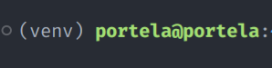
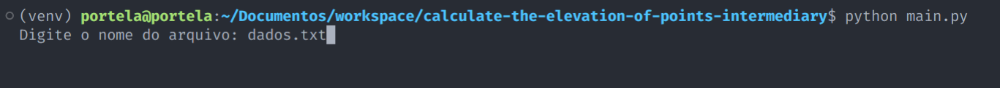
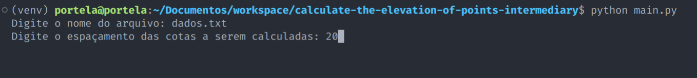
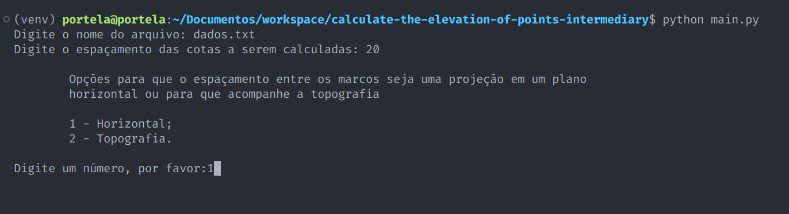
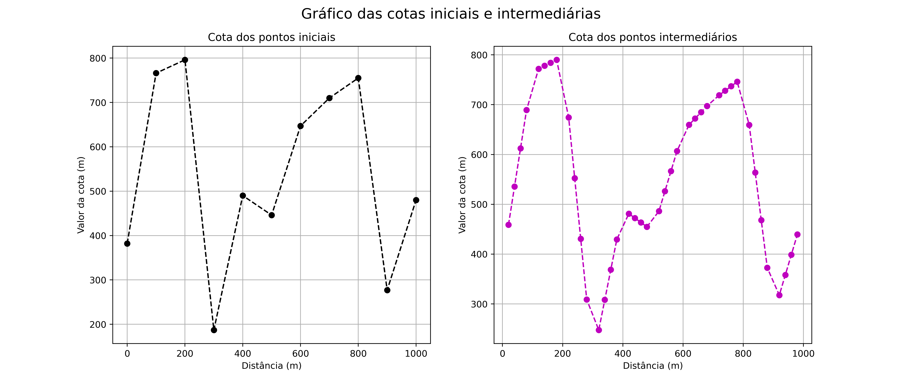
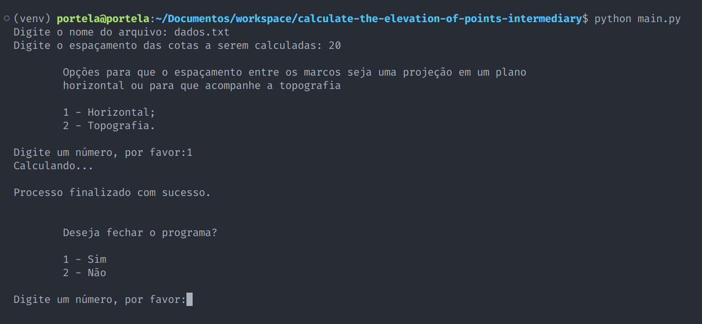

<!-- @import "tutorial/style.html" -->

# Problema das cotas

## Documentação de uso do programa

    Discente: Danilo Portela de Oliveira
    Matrícula: 222105229
    Disciplina: PROGRAMAÇÃO PARA GEOCIÊNCIAS

O programa foi desenvolvido com o objetivo de calcular cotas de pontos intermediários a outros com cotas previamente medidas. A Figura 1 mostra a arquitetura do projeto, onde no arquivo functions.py encontra-se as funções necessárias para o desenvolvimento do programa, o arquivo main.py é o arquivo principal, ou seja, toda a árvore de componetes é desenvolvida nesse arquivo, na pasta "datas" encontra-se o arquivo dados.txt (mostrado na Figura 2) contendo o ID do Marco Topográfico, a cota (metros) dos pontos medidos, que estão igualmente espaçados em superfície, sendo o espaçamento entre eles (100 metros) e o arquivo "requirements.txt" é o arquivo com as vesões das bibliotecas instaladas.


<p class="legend"> Figura 1: Arquitetura do porjeto. </p>


<p class="legend"> Figura 2: Estrutura dos dados de entrada. </p>

### Exemplo de uso:

#### Passo 1:

O usuário pode optar por criar um ambiente virtual por meio do comando ```python -m venv venv```, logo, ativar o ambiente virtual "venv" com o comando ```source ./venv/bin/activate``` se estiver no Linux, caso esteja no Windows, basta utilizar o comando ```source ./venv/Script/Activate```. Feito isso, o usuário estará fazendo todas as intalações de bibliotecas neste ambiente virtual (Figura 3) utilizando o "requirements.txt". Para isso, basta usar o comando ```pip install -r requirements.txt```. Para desativar o ambiente virtual, basta utilizar o comando ```deactivate```.



<p class="legend"> Figura 3: Ambiente virtual ativado. </p>


#### Passo 2:

Após criar o ambiente virtual e instalar as bibliotecas, o programa está pronto para funcionar. Então, por meio do comando ```python main.py``` o programa irá ser executado. O programa irá solicitar que o usuário informe o nome do arquivo que encontra-se na pasta "datas" (Figura 4) contendo a elevação dos pontos medidos (como mostrado na Figura 2).



<p class="legend"> Figura 4: Entrada do arquivo contendo a elevação dos pontos medidos. </p>

#### Passo 3:

Após o usuário informar o nome corretamente do arquivo .txt que encontra-se na pasta "datas", o usuário agora deve digitar o espaçamento das cotas a serem calculadas (Figura 5).



<p class="legend"> Figura 5: Espaçamento das cotas a serem calculadas.

#### Passo 4:

Nesse quarto passo, o usuário faz a escolha das opções para que o espaçamento entre os marcos seja uma projeção em um plano horizontal ou para que acompanhe a topografia (Figura 6).



<p class="legend"> Figura 6: Escolher se a projeção é em um plano horizontal ou acompanhando a topografia.

#### Passo 5:

Após o usuário escolher a opção, o cálculo das cotas intermediárias é realizado e uma pasta "tables" e "figures" é criado. Na pasta "tables" contém o arquivo .csv contendo as novas posições e cotas calculadas (Figura 8). Na pasta "figures" contém os gráficos com as cotas medidas anteriormente e as calculadas para fins de comparação (Figura 7).




<p class="legend"> Figura 7: Gráfico com espaçamento entre os marcos de 20 metros, onde a projeção é em um plano horizontal.


<p class="legend"> Figura 8: Tabela com as novas posições e cotas calculadas.

#### Passo 6:

Após a finalização do cálculo das cotas intermediárias, o progrma informa ao usuário se deseja fechar o programa. Caso o usuário escolha a opção de continuar rodando o progaram, todo o processo é reiniciado, ou seja, o programa volta para o passo 1. Se o usuário escolher fechar o programa, o mesmo é encerrado.



<p class="legend"> Figura 9: Opção para fechar ou continuar a execução do programa.