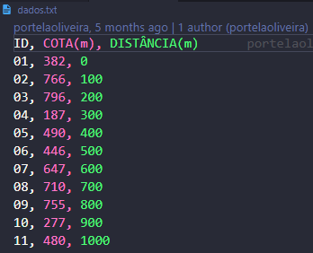

<!-- @import "tutorial/style.html" -->

# Problema das cotas

## Documentação de uso do programa

    Discente: Danilo Portela de Oliveira
    Docente: Marcelo Peres Rocha
    Matrícula: 222105229
    Disciplina: PROGRAMAÇÃO PARA GEOCIÊNCIAS

O programa foi desenvolvido com o objetivo de calcular cotas de pontos intermediários a outros com cotas previamente medidas. A Figura 1 mostra a arquitetura do projeto. Na pasta "datas" encontra-se o arquivo dados.txt (mostrado na Figura 2) para testes, contendo o ID do Marco Topográfico, a Cota (metros) dos pontos medidos e a Distância entre cada ponto que estão igualmente espaçados em superfície, sendo o espaçamento entre eles (100 metros). Na Figura 3 é mostrado a tela principal do programa.

 Figura 1: Arquitetura do porjeto. 

 Figura 2: Estrutura dos dados de entrada do arquivo .txt. 

 Figura 3: Tela principal. 

### Exemplo de uso:

#### Passo 1:

Para usar o programa, basta o usuário selecionar o arquivo .txt, tal que, o conteúdo do arquivo deve seguir a estrutura mostrada na Figura 2, ou seja, com Id, Cota e Distância. Após selecionar o arquivo, o usuário seleciona a pasta de saída (local onde o resultado dos cálculos serão salvos). Depois, o usuário deve informar o espaçamento das cotas a serem calculadas e escolhe a projeção, ou seja, se o espaçamento entre os marcos é uma projeção em um plano horizontal ou se a projeção acompanha a topografia. Feito isso, basta clicar no botão "Calcular cotas intermediárias" e o cálculo das cotas intermediárias é realizado e uma pasta "tables" e "figures" é criado (Figura 4). Na pasta "tables" contém o arquivo .csv contendo as novas posições e cotas calculadas (Figura 5). Na pasta "figures" contém os gráficos com as cotas medidas anteriormente e as calculadas para fins de comparação (Figura 6).

 Figura 4: Pastas "tables" e "figures". 

 Figura 5: Arquivo csv. 

 Figura 6: Gráficos. 

#### Passo 2:

Se não ocorrer nenhum erro, aparecerá um popup informando que o cálculo foi realizado com sucesso (Figura 7), caso o arquivo de entrada esteja incorreto, aparecerá um popup informando o erro.

 Figura 7: Popup de informação. 

